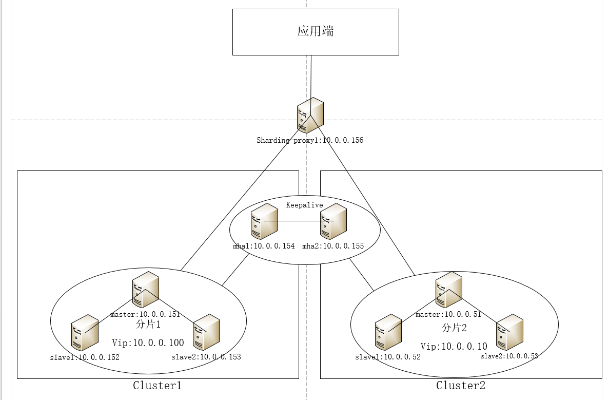
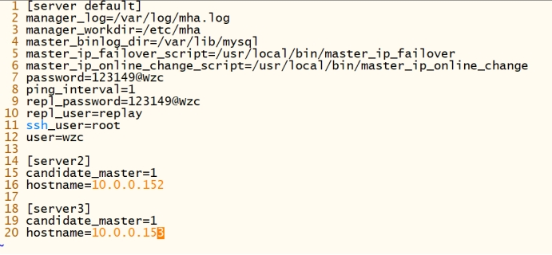
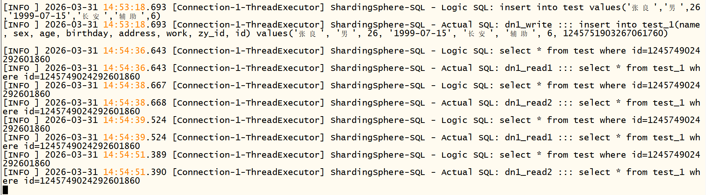
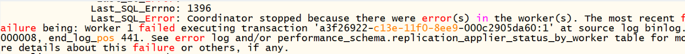
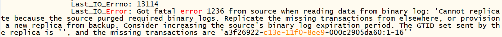
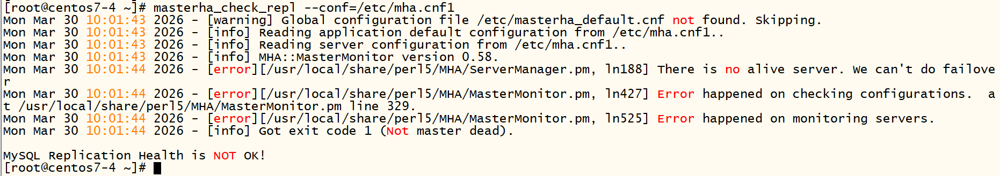
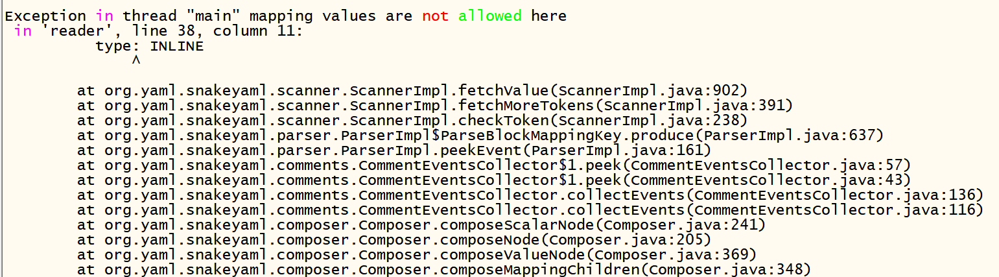

***\*一、需求分析\****

***\*背景\****

随着公司的业务规模扩大，公司当前需要搭建一套新的mysql架构。

***\*要求\****

1、集群自动故障切换；

2、主库从库实现读写分离，主库只负责写操作，并且从库还要负载均衡；

3、考虑到业务的规模，需要进行分库分表。

***\*技术选型\****

集群使用MHA+keepalived高可用方案，MHA久经市场考验，技术成熟稳定；keepalived类似于网络通信技术中的VRRP，可虚拟出一个VIP（virtual ip），上层只需访问VIP，对下层的故障切换无感知，不过在这里不需要VIP，只需要自动执行脚本的功能。ShardingSphere是目前最流行的中间件技术，其功能有：分库分表，读写分离，负载均衡，这里使用sharding-proxy形态。

***\*架构图\****



***\*优化\****

架构图中的sharding-proxy存在单点故障问题，可以再配置一台sharding-proxy服务器（注意YAML配置必须一致），并且再搭建负载均衡层haproxy+keepalived，应用端连接负载均衡层，中间件层连接负载均衡层。这样就解决了单点故障问题，对负载均衡层感兴趣的朋友可以访问我的另一套架构方案中的haproxy+keepalived部分 https://github.com/wuzhiceng/MySQL-HA-Architecture-Solution-Two

***\*二、环境准备\****

| 服务器           | IP         | 角色   | 操作系统 | Mysql版本 |
| ---------------- | ---------- | ------ | -------- | --------- |
| Master(cluster1) | 10.0.0.151 | 主库   | Centos7  | 8.0.43    |
| Slave1(cluster1) | 10.0.0.152 | 从库   | Centos7  | 8.0.43    |
| Slave2(clusetr1) | 10.0.0.153 | 从库   | Centos7  | 8.0.43    |
| Master(cluster2) | 10.0.0.51  | 主库   | Centos7  | 8.0.43    |
| Slave1(cluster2) | 10.0.0.52  | 从库   | Centos7  | 8.0.43    |
| Slave1(cluster2) | 10.0.0.53  | 从库   | Centos7  | 8.0.43    |
| Mha1             | 10.0.0.154 | Master | Centos7  | NULL      |
| Mha2             | 10.0.0.155 | Backup | Centos7  | NULL      |
| Sharding-proxy   | 10.0.0.156 | NULL   | Centos7  | NULL      |

***\*防火墙\****

Centos> iptables -I INPUT x -p tcp --dport 3306 -j ACCEPT #在mysql服务器上配置，x是插入位置，根据自身条目选择       
Centos> iptables -I INPUT x -p tcp --dport 3307 -j ACCEPT #在sharding上配置 
Centos> service iptables save  #添加好规则后保存   

***\*Mysql配置文件\****

10.0.0.151的my.cnf文件如下，其他服务器参考该文件

```
datadir=/var/lib/mysql #数据库目录                     
socket=/var/lib/mysql/mysql.sock  #套接字文件               
log-error=/var/log/mysqld.log  #日志文件                 
pid-file=/var/run/mysqld/mysqld.pid  #进程号文件             
binlog_rows_query_log_events=on #开启可使用show binlog events in 'binlog文件';命令                             
server-id=513306 #服务id，用来唯一标识一个mysql实例，注意不能重复了
max_binlog_size=2G  #binlog日志的大小，默认1024M            
expire_logs_days=7  #binlog日志最长保留多少天            
binlog_cache_size=1M #binlog日志的缓存大小                
log_timestamps = SYSTEM #把mysqld.log文件的时间戳改成系统时间，默认是纽约时间                                  
#-------从库配置-----------------------------------------------                 
#master_info_repository=table #把主库的信息存在表中              
#relay_log_info_repository=table  #把中继日志信息存在表中             
#read_only=1 #只读模式，不过对root账号无效                
#-------GTID配置-----------------------------------------------                
gtid_mode=on #开启GTID，方便排错以及故障切换             
enforce_gtid_consistency=on  #禁止执行GTID不兼容的SQL           
log_slave_updates=on #从库将中继日志中的事件，记录到二进制日志中      
binlog_gtid_simple_recovery=on  #MySQL 在启动恢复 GTID 状态时，使用简化算法，减少 binlog 扫描，加快恢复速度           
#-------无损半同步配置-----------------------------------------             
plugin_load="rpl_semi_sync_master=semisync_master.so;rpl_semi_sync_slave=semisync_slave.so"  #加载相关插件     
rpl_semi_sync_master_enabled =on  #主库开启半同步，从库需关闭                         
rpl_semi_sync_slave_enabled =off  #从库开启半同步，主库需关闭                          
rpl_semi_sync_master_timeout = 5000 #主库等待从库ack的超时时间，单位毫秒                                     
rpl_semi_sync_master_wait_point = AFTER_SYNC  #设置为增强版半同步复制，主从数据一致性比默认的异步复制更好             
rpl_semi_sync_master_wait_for_slave_count = 1  #设置主库需得到多少个从库的ack才能把事务标记为commit   
```

***\*三、搭建\****

***\*配置主从复制（10.0.0.151/152/153）\****

主库10.0.0.151创建一个账号并授权，用于从库连接主库

mysql> create user replay@'%' identified by 'replay123';
mysql> grant replication slave on *.* to replay@'%';

从库10.0.0.152/153配置主库信息并启动复制

mysql> CHANGE REPLICATION SOURCE TO SOURCE_HOST='10.0.0.151' , SOURCE_USER='replay',SOURCE_PASSWORD='replay123',SOURCE_AUTO_POSITION=1,GET_SOURCE_PUBLIC_KEY=1; #8.0版本之后mysql身份验证插件是 caching_sha2_password，该插件要求在连接mysql时密码需要用mysql的公钥进行加密传输，而GET_SOURCE_PUBLIC_KEY=1表示从库没有主库的公钥可以让主库发给你
mysql> start replica;

测试主从复制是否成功，在从库上执行show replica status\G查看主从状态，重点关注以下两行，IO线程yes表示连接正常，SQL线程yes表示中继日志可以被重做

 

***\*配置主从复制（10.0.0.51/52/53）\****

参考配置主从复制（10.0.0.151/152/153），这里不再赘述

***\*准备好perl环境并安装MHA软件（10.0.0.151/152/153/154/155/51/52/53）\****

Centos> yum -y install perl-DBD-MySQL perl-devel perl-CPAN perl-Config-Tiny perl-Log-Dispatch perl-Parallel-ForkManager perl-Time-HiRes nc #大部分来自于epel仓库，需要事先下载epel仓库
Centos> rpm -ivh mha4mysql-node-0.58-0.el7.centos.noarch.rpm #安装node包，负责接收manager的指令并执行
Centos> rpm -ivh mha4mysql-manager-0.58-0.el7.centos.noarch.rpm #只需154/155上安装manager包，通过ssh连接node节点，对node节点进行监控

***\*配置SSH免密登录（10.0.0.154/155）\****

Centos> ssh-keygen -t rsa #生成SSH密钥
Centos> ssh-copy-id [root@x.x.x.x](mailto:root@x.x.x.x) #将SSH密钥分发给所有node节点
Centos> ssh root@x.x.x.x date #测试是否不需要密码

node节点相互之间也要SSH免密登录，参考上面的配置

***\*配置MHA配置文件以及相关脚本(10.0.0.154/155)\****

Centos> vim /etc/mha.cnf1

```
[server default]
manager_workdir=/etc/mha  #工作目录
manager_log=/var/log/mha.log #日志文件
# 用于管理机登录并管理集群的账号和密码
user=wzc
password=wzc123
# 用于主从复制的账号和密码
repl_user=replay
repl_password=replay123
ssh_user=root  #ssh用户
ping_interval=1 #检测间隔
master_binlog_dir=/var/lib/mysql #集群存放binlog日志的目录
master_ip_failover_script=/usr/local/bin/master_ip_failover1  #故障切换脚本
master_ip_online_change_script=/usr/local/bin/master_ip_online_change1 #在线切换脚本

[server1]
hostname=10.0.0.151
candidate_master=1

[server2]
hostname=10.0.0.152
candidate_master=1

[server3]
hostname=10.0.0.153
candidate_master=1 #如果不想让 153 成为主库（比如机器配置差），可以设为 0           
```

master_ip_failover1和master_ip_online_change1脚本代码太多了，请自行查看对应文件，这里就不放了

Centos> vim /etc/mha.cnf2

```
[server default]
manager_workdir=/etc/mha  #工作目录
manager_log=/var/log/mha.log #日志文件
# 用于管理机登录并管理集群的账号和密码
user=wzc
password=wzc123
# 用于主从复制的账号和密码
repl_user=replay
repl_password=replay123
ssh_user=root  #ssh用户
ping_interval=1 #检测间隔
master_binlog_dir=/var/lib/mysql #集群存放binlog日志的目录
master_ip_failover_script=/usr/local/bin/master_ip_failover2  #故障切换脚本
master_ip_online_change_script=/usr/local/bin/master_ip_online_change2 #在线切换脚本

[server1]
hostname=10.0.0.51
candidate_master=1

[server2]
hostname=10.0.0.52
candidate_master=1

[server3]
hostname=10.0.0.53
candidate_master=1
```

master_ip_failover2和master_ip_online_change2脚本代码太多了，请自行查看对应文件，这里就不放了

***\*绑定VIP（10.0.0.151/51）\****

master_ip_failover脚本只负责故障切换时将vip飘逸到新主，不负责绑定vip，所以需要手动绑定

Centos> ip addr add 10.0.0.100/24 dev ens33 && arping -q -c 3 -A -I ens33 10.0.0.100  #10.0.0.151上配置，网卡根据自身情况选择
Centos> ip addr add 10.0.0.10/24 dev ens33 && arping -q -c 3 -A -I ens33 10.0.0.10  #10.0.0.51上配置，网卡根据自身情况选择

***\*状态检测（10.0.0.154/155）\****

Centos> masterha_check_ssh --conf=/etc/mha.cnf1 #检查到node节点的ssh连接，如果全部ok表示正常
Centos> masterha_check_repl --conf=/etc/mha.cnf1 #检查集群主从复制状态
Centos> masterha_check_ssh --conf=/etc/mha.cnf2
Centos> masterha_check_repl --conf=/etc/mha.cnf2

***\*安装keepalived（10.0.0.154/155）\****

Centos> yum -y install kernel-devel openssl-devel popt-devel
Centos> cd /usr/local/src/keepalived-1.4.4
Centos> ./configure
Centos> make&&make install

***\*配置keepalived的配置文件以及相关脚本（10.0.0.154）\****

Centos> mv /etc/keepalived/keepalived.conf /etc/keepalived/keepalived.bak  #对默认的配置文件进行备份

Centos> vim /etc/keepalived/keepalived.conf

```
! Configuration File for keepalived
global_defs {
  router_id mysql_ha_154 #配置router-id
  script_user root  #执行脚本的系统用户
  enable_script_security
}

vrrp_instance v_mysql_slave_wgpt1 {
  interface ens33 #网卡名，根据自身情况添加
  state BACKUP  #初始状态，最终状态由priority决定
  virtual_router_id 65  #VRRP组ID，主从必须一致
  priority 200  #优先级，优先级高的为主
  nopreempt  #非抢占模式

  notify_master /etc/keepalived/script/mha_start.sh  #角色为master时执行后面的脚本
  notify_backup /etc/keepalived/script/mha_stop.sh   #角色为backup时执行后面的脚本
  notify_stop /etc/keepalived/script/mha_stop.sh  #keepalived进程如果要停止了，在停止前执行后面的脚本
}
```

Centos> vim /etc/keepalived/script/mha_start.sh

```
#!/bin/bash
nohup /usr/bin/masterha_start.sh >/dev/null 2>&1 & #后台运行/usr/bin/masterha_start.sh脚本
```

Centos> vim /etc/keepalived/script/mha_stop.sh

```
#!/bin/bash
kill `ps aux | grep masterha_start.sh | grep -v grep | awk '{print $2}'` >/dev/null  #停止运行/usr/bin/masterha_start.sh脚本
masterha_stop --conf=/etc/mha.cnf  #停止运行MHA
```

Centos> Vim /usr/bin/masterha_start.sh  

```
#!/bin/bash
while true;do
  if [ `ps aux | grep mha.cnf1 | grep -v grep | wc -l` -eq 0 ];then
	nohup masterha_manager --conf=/etc/mha.cnf1 --remove_dead_master_conf --ignore_last_failover < /dev/null &>/var/log/mha.log &
  fi

  if [ `ps aux | grep mha.cnf2 | grep -v grep | wc -l` -eq 0 ];then
    nohup masterha_manager --conf=/etc/mha.cnf1 --remove_dead_master_conf --ignore_last_failover < /dev/null &>/var/log/mha.log &
  fi
  
  sleep 10
done
##这个脚本的作用就是一直循环检测MHA是否停止了，如果停止了就启动，为防止MHA频繁停止启动，每次启动后停止10秒。至于为什么要这样，因为MHA帮助故障切换一次后就会停止运行
```

Centos> chmod u+x /etc/keepalived/script/mha_start.sh /etc/keepalived/script/mha_stop.sh
/usr/bin/masterha_start.sh #为执行脚本添加执行权限

***\*配置keepalived的配置文件以及相关脚本（10.0.0.155）\****

Centos> mv /etc/keepalived/keepalived.conf /etc/keepalived/keepalived.bak  #对默认的配置文件进行备份

Centos> vim /etc/keepalived/keepalived.conf

```
! Configuration File for keepalived
global_defs {
  router_id mysql_ha_155 #配置router-id
  script_user root  #执行脚本的系统用户
  enable_script_security
}

vrrp_instance v_mysql_slave_wgpt1 {
  interface ens33 #网卡名，根据自身情况添加
  state BACKUP  #初始状态，最终状态由priority决定
  virtual_router_id 65  #VRRP组ID，主从必须一致
  priority 100  #优先级，优先级高的为主
  nopreempt  #非抢占模式

  notify_master /etc/keepalived/script/mha_start.sh  #角色为master时执行后面的脚本
  notify_backup /etc/keepalived/script/mha_stop.sh   #角色为backup时执行后面的脚本
  notify_stop /etc/keepalived/script/mha_stop.sh  #keepalived进程如果要停止了，在停止前执行后面的脚本
}
```

下面3个脚本和10.0.0.154上的一致

/etc/keepalived/script/mha_start.sh /etc/keepalived/script/mha_stop.sh

/usr/bin/masterha_start.sh

***\*启动keepalived服务（10.0.0.154/155）\****

Centos> systemctl start keepalived #154上先启动，这样就能成为master

如果你有全部看完keeplived的配置文件和相关脚本，就能发现不需要你手动启动MHA，且154和155只有一台能启动MHA进程，这是因为两台都启动会发生脑裂

***\*安装jdk（10.0.0.156）\****

Sharding-proxy需要依赖java环境，所以要先安装jdk

Centos> tar -xvf jdk-8u471-linux-x64.tar.gz -C /data/apps/.  #把压缩包解压到指定目录
Centos> echo PATH=/data/apps/jdk1.8.0_471/bin:$PATH >> /etc/profile&&source /etc/profile  #把jdk的目录添加到PATH中

***\*安装sharding-proxy（10.0.0.156）\****

Centos> tar -xvf apache-shardingsphere-5.5.2-shardingsphere-proxy-bin.tar.gz -C /data/apps/. #解压并安装到指定目录

***\*配置yaml文件（10.0.0.156）\****

yaml文件在安装目录的conf目录下，shardingsphere提供了大量的分片算法，这里就使用常用的INLINE算法，将一张大表取模分片到2个分片节点(分库)，在分片节点内再将表分成2张小表（分表）

Centos> mv global.yaml global.yaml.bak && mv database-sharding.yaml database-sharding.yaml.bak #把默认的配置文件进行备份

Centos> vim global.yaml

```
mode:
 type: Standalone #模式类型，这里选择单机模式
 repository:
  type: file #yaml文件存储在本地

authority:  #配置用户密码以及权限信息，用于sharding连接mysql集群
 users:
   - user: wzc@%
   password: wzc123
 privilege:
  type: ALL_PERMITTED

transaction:
 defaultType: XA  #分布式事务的处理模式，XA模式使得数据强一致性且部署简单，但是性能差
 providerType: Atomikos

props:  #属性配置
 sql-show: true  #开启sql打印功能，可以打印出实际执行的sql以及路由到了哪个数据源。测试环境下打开可方便排查故障，生产环境下最好关闭
```

Centos> vim database-sharding.yaml  #该文件代码太长，请查看对应文件，这里就不放了

***\*启动sharding-proxy\****

进入安装目录下的bin目录，该目录下有启动start.sh和停止stop.sh脚本

***\*四、测试\****

***\*测试mysql集群的故障切换\****

以cluster1为例，模拟主库10.0.0.151故障的情况

1、hostname -I查看vip，此时vip在主库10.0.0.151上，systemctl stop mysqld停止主库的mysqld进程

2、查看vip，此时切换到了152或者153，拥有vip的就是新主库，登录新主库执行show replicas;可以看到从库的信息，从而进一步验证主从

3、查看/etc/mha.cnf1文件，发现10.0.0.151的信息没有了，MHA的设计就是如此，若原主库10.0.0.151恢复后要继续使用，需要在mha.cnf1中补齐151的信息，并且把151配置为新主库的从库

 

***\*测试manager节点是否存在单点故障\****

目前10.0.0.154为master，模拟master故障的情况

1、ps aux | grep masterha_manager查看MHA进程的情况，发现154有两个进程，而155没有。systemctl stop keepalived停止154的keepalived服务    

2、再次查看MHA进程信息，此时154没有信息，而155有两个进程，说明此时155是master状态

3、启动154的keepalived服务，再次查看MHA的进程信息，结果与2一致，说明master没有被抢占。若154的新能更好，需要进行抢占，修改154的keepalived.conf文件，把初始状态设为MASTER

***\*测试分库分表\****

Centos> mysql -uwzc -pwzc123 -P3307 -h10.0.0.156 sharding_db

登录到156的逻辑库sharding_db中，注意端口号是3307，创建测试表test，要求分片键id的类型为BIGINT，插入数据时不用插入id值，由系统自动分配id值，这是因为如果选择主键自增，会导致不同数据源的主键冲突，而由系统通过雪花算法来分配就能避免冲突，缺点是系统分配的主键不是连续递增的、主键的类型必须是BIGINT、系统时间不能出错

***\*测试读写分离和负载均衡\****

1、另外开启一个会话连接到10.0.0.156，执行centso> tail -Fn0 /data/apps/sharding-proxy/logs/stdout.log 观察路由情况，此外报错信息也在这个文件中

2、往test表中插入数据，并且重复读取某条数据，路由情况如下图所示，写操作只会路由到主库，读操作只会路由到从库，并且读操作一直是轮询负载到从库   



***\*五、常见错误排查\****

***\*主从复制没有建立起来\****

1、从库查看主从复制状态，SQL线程为no，报错信息如图所示，这是因为主库的这个事务没办法在从库重做，故而报错，比如这个事务是删除某张表，但是创建该表的binlog日志已经过期了，导致同步过来后从库没有该表，而这个事务突然要删除一张不存在的表所以引发了错误。解决办法：先看下这个事务的内容，能手动补齐数据就补齐，命令如下：

```
STOP REPLICA; 
SET GTID_NEXT = 'UUID+事务序列号'; 
BEGIN; 
...... #缺失的SQL
COMMIT; 
SET GTID_NEXT='AUTOMATIC’; 
START REPLICA;
```



2、从库查看主从复制状态，SQL线程为no，报错信息如图所示，这是因为这段GTID对应的binlog日志没有了，可能系统定期清理了也可能是人为删除了，事务数量比较多，如果一个个去补齐太麻烦了。如果主库的数据量比较小，就用备份恢复或者克隆手段恢复；如果主库数据量太大，就用数据校验工具pt-table-checksum恢复



***\*MHA状态检测失败\****

检查主从复制状态masterha_check_repl失败，报错如图所示，这是因为mysql8.0以上的默认的认证插件是caching_sha2_password，而manager节点是centos7系统，perl-DBD-MySQL驱动(4.023)太老不支持caching_sha2_password插件，导致manager无法连接集群。解决办法：

1、mysql> alter user wzc@'%' identified with mysql_native_password by 'wzc123';  #在主库上把manager的连接账号改为mysql_native_password插件

2、manager节点使用centos8及以上系统，centos8系统的perl-DBD-MySQL驱动(4.046)较新，可以支持caching_sha2_password认证插件



***\*Sharding-proxy启动失败\****

启动时没有成功，查看stdout.log文件发现如图所示的报错，这是yaml文件出现了语法错误，检查一下yaml配置。启动失败大部分情况下都是yaml配置有语法、逻辑或者行缩进错误导致的



